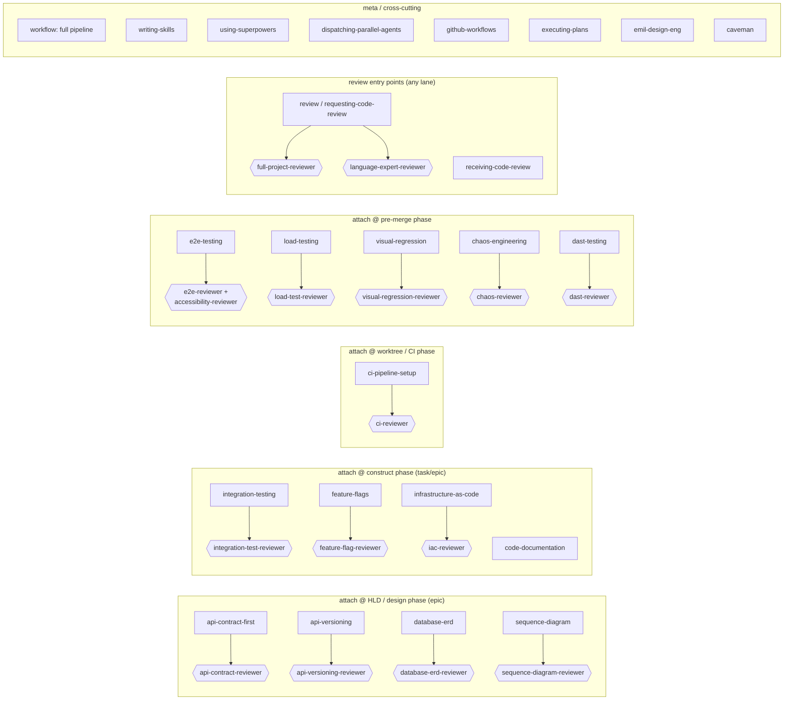

# Engineer Skill Map

Single doorway: `/engineer`. Classifies request → routes to one of 5 lanes → each lane
runs a skill chain → some skills pair with a reviewer agent (⊘ = quality gate).

Every skill below = "how to reason/work" for one job. Only `/engineer` is an entry point.

## Verified reachability (not assumed)

Edges below are extracted from actual skill-file cross-references (one skill's body
naming another), not asserted from intent. Directed BFS from `engineer`:

- **47 / 49 skills reachable.**
- **2 orphans, by design:** `caveman` (session-hook comms style, not an engineering-lane
  step) and `emil-design-eng` (its own doorway — points at `engineer`, not named by it).
- Verification script: `scratchpad/graph.py` pattern — rebuild by scanning each
  `skills/*/SKILL.md` body for other skill names as whole tokens, BFS from `engineer`.

Wiring added to close the gap from 39→47 (each is a real trigger line in the named
file, not a cosmetic mention):

| Orphan (was unreachable) | Wired into | Trigger |
| --- | --- | --- |
| `receiving-code-review` | `requesting-code-review` | act on findings after a review |
| `dispatching-parallel-agents` | `epic-decomposition` | 2+ independent stories in one wave |
| `dast-testing` | `finishing-a-development-branch` | externally-facing service, pre-merge |
| `visual-regression` | `e2e-testing` | UI feature, after E2E baseline exists |
| `feature-flags` | `deployment-workflow` | rollout needs a kill switch / ramp |
| `github-workflows` | `ci-pipeline-setup` | platform detected = GitHub Actions |
| `using-superpowers` | `engineer` | skill not named in any lane — discover it |
| `writing-skills` | `using-superpowers` | no skill covers a recurring pattern |

## Full graph

```mermaid
flowchart TD
    USER([User request]) --> ENG{{"/engineer<br/>ROUTER<br/>classify + confirm"}}

    ENG -->|"defect, 1 symbol"| QF[QUICK-FIX lane]
    ENG -->|"bounded feature"| TASK[TASK lane]
    ENG -->|"new service/system"| EPIC[EPIC lane]
    ENG -->|"spike / POC / compare"| RES[RESEARCH lane]
    ENG -->|"wrong shape, 0 new behavior"| REF[REFACTORING lane]

    %% Universal constraints — active in every lane
    ENG -.always on.-> KARP[karpathy lens]
    ENG -.always on.-> DP[design-principles]

    %% ---------- QUICK-FIX ----------
    QF --> qf1[systematic-debugging]
    QF --> qf2[codebase-comprehension]
    QF --> qf3[test-driven-development]
    QF --> qf4[verification-before-completion]
    QF --> qf5[commit-discipline]
    qf4 -.⊘.-> AR1{{linter-reviewer}}

    %% ---------- TASK ----------
    TASK --> t1[codebase-comprehension]
    TASK --> t2[brainstorming]
    TASK --> t3[spec-quality-gate]
    TASK --> t4[writing-plans]
    TASK --> t5[using-git-worktrees]
    TASK --> t6[subagent-driven-development]
    TASK --> t7[verification-before-completion]
    TASK --> t8[requesting-code-review]
    TASK --> t9[pr-creator]
    TASK --> t10[finishing-a-development-branch]
    t3 -.⊘.-> AR2{{spec-quality-reviewer}}
    t4 -.⊘.-> AR3{{plan-reviewer}}
    t7 -.⊘.-> AR1
    t8 -.⊘.-> AR4{{pr-reviewer}}
    t9 -.⊘.-> AR5{{"pr-reviewer + security-reviewer<br/>+ spec-impl-reviewer<br/>+ test-quality-reviewer"}}

    %% ---------- EPIC ----------
    EPIC --> e1[business-context-intake]
    EPIC --> e2[brainstorming]
    EPIC --> e3[spec-quality-gate]
    EPIC --> e4[high-level-design]
    EPIC --> e5[epic-decomposition]
    EPIC --> e6[["per child story:<br/>recurse /engineer @ task lane"]]
    EPIC --> e7[deployment-workflow]
    EPIC --> e8[observability-standards]
    EPIC --> e9[incident-response]
    EPIC --> e10[onboarding-guide]
    e1 -.⊘.-> AR6{{business-context-reviewer}}
    e3 -.⊘.-> AR2
    e4 -.⊘.-> AR7{{"hld-reviewer<br/>→ HUMAN approves"}}
    e7 -.⊘.-> AR8{{deployment-reviewer}}
    e8 -.⊘.-> AR9{{observability-reviewer}}
    e9 -.⊘.-> AR10{{incident-response-reviewer}}
    e10 -.⊘.-> AR11{{onboarding-reviewer}}
    e6 -.recurse.-> TASK

    %% ---------- RESEARCH ----------
    RES --> r1[codebase-comprehension]
    RES --> r2[research-spike]

    %% ---------- REFACTORING ----------
    REF --> f1[codebase-comprehension]
    REF --> f2[refactoring]
    REF --> f3[verification-before-completion]
    REF --> f4[commit-discipline]
    f3 -.⊘.-> AR1
```

## Auxiliary skills (phase-attached, not named in a lane)

Epic lane = "~all 44 skills". These fire inside a lane phase when the work needs them.
They teach how to reason about one concern; they hang off the phase shown.

## Legend

- `{{ }}` double-hex = **reviewer agent** (quality gate, Opus/Sonnet)
- `⊘` = skill dispatches that agent as a hard gate — FAIL blocks advance
- solid arrow = lane invokes skill in order
- dashed = gate check or "always active"
- `[[ ]]` = recursion point (epic child → task lane)

## Reasoning model

- **One doorway.** `/engineer` is the only entry point. It never works — it routes.
- **Lanes = magnitude.** quick-fix (minutes) → task (hours) → epic (days) ; research + refactoring are side-shaped.
- **Skills = how to reason.** Each skill is a focused method for one job (debug, spec, plan, test, review). They don't decide *whether* to run — the lane does.
- **Agents = gates.** Reviewer agents verify a skill's output before the chain advances. ⊘ = hard block.
- **Auxiliary skills** attach to a phase when the work touches that concern (new API → api-contract-first; UI → e2e/visual; new infra → IaC).
