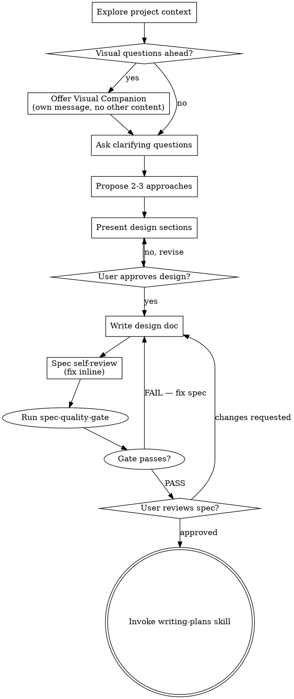

# Brainstorming Ideas Into Designs

Help turn ideas into fully formed designs and specs through natural collaborative dialogue.

Start by understanding the current project context, then ask questions one at a time to refine the idea. Once you understand what you're building, present the design and get user approval.

## References — What a Great Spec Looks Like

These are the north star. Every spec written here should aspire to this bar.

**SQLite** — [requirements.html](https://sqlite.org/requirements.html)
Every requirement has a test ID. Test suite is 8× larger than the implementation. Richard Hipp's rule: if it's not tested, it doesn't exist. Every statement is immediately testable.

**RFC 8446 (TLS 1.3)** — IETF RFC format
Every state, every transition, every error condition named. Implementable from the doc alone. The MUST/SHOULD/MAY taxonomy forces every statement to be universal truth or verifiable behavior.

**seL4 microkernel** — NICTA/Data61
Spec written in Isabelle/HOL. Mathematically proven correct. If the proof compiles, the code is correct by construction. Ultimate form of the contract idea.

**WebAssembly specification** — W3C
Every instruction has formal reduction rules. No ambiguity possible. Multiple independent implementations converged on identical behavior from the spec alone.

**DO-178C** — aviation flight software standard
Every requirement traced to a test, every test traced to a requirement. No orphans. Traceability matrix is a mandatory deliverable.

<HARD-GATE>
Do NOT invoke any implementation skill, write any code, scaffold any project, or take any implementation action until you have presented a design and the user has approved it. This applies to EVERY project regardless of perceived simplicity.
</HARD-GATE>

## Anti-Pattern: "This Is Too Simple To Need A Design"

Every project goes through this process. A todo list, a single-function utility, a config change — all of them. "Simple" projects are where unexamined assumptions cause the most wasted work. The design can be short (a few sentences for truly simple projects), but you MUST present it and get approval.

## Checklist

You MUST create a task for each of these items and complete them in order:

1. **Explore project context** — check files, docs, recent commits
2. **Offer visual companion** (if topic will involve visual questions) — this is its own message, not combined with a clarifying question. See the Visual Companion section below.
3. **Ask clarifying questions** — one at a time, understand purpose/constraints/success criteria
4. **Propose 2-3 approaches** — with trade-offs and your recommendation
5. **Present design** — in sections scaled to their complexity, get user approval after each section
6. **Write design doc** — save to `.ai/specs/YYYY-MM-DD-<topic>-design.md` using requirement format (see below); commit
7. **Spec self-review** — quick inline check for placeholders, contradictions, ambiguity, scope (see below)
8. **Run spec-quality-gate** — invoke `spec-quality-gate` skill; fix all FAIL items before proceeding
9. **User reviews written spec** — ask user to review the spec file before proceeding
10. **Transition to implementation** — invoke writing-plans skill to create implementation plan

## Process Flow



**The terminal state is invoking writing-plans.** Do NOT invoke frontend-design, mcp-builder, or any other implementation skill. The ONLY skill you invoke after brainstorming is writing-plans.

## The Process

**Understanding the idea:**

- Check out the current project state first (files, docs, recent commits)
- Before asking detailed questions, assess scope: if the request describes multiple independent subsystems (e.g., "build a platform with chat, file storage, billing, and analytics"), flag this immediately. Don't spend questions refining details of a project that needs to be decomposed first.
- If the project is too large for a single spec, help the user decompose into sub-projects: what are the independent pieces, how do they relate, what order should they be built? Then brainstorm the first sub-project through the normal design flow. Each sub-project gets its own spec → plan → implementation cycle.
- For appropriately-scoped projects, ask questions one at a time to refine the idea
- Prefer multiple choice questions when possible, but open-ended is fine too
- Only one question per message - if a topic needs more exploration, break it into multiple questions
- Focus on understanding: purpose, constraints, success criteria

**Exploring approaches:**

- Propose 2-3 different approaches with trade-offs
- Present options conversationally with your recommendation and reasoning
- Lead with your recommended option and explain why

**Presenting the design:**

- Once you believe you understand what you're building, present the design
- Scale each section to its complexity: a few sentences if straightforward, up to 200-300 words if nuanced
- Ask after each section whether it looks right so far
- Cover: architecture, components, data flow, error handling, testing
- Be ready to go back and clarify if something doesn't make sense

**Design for isolation and clarity:**

- Break the system into smaller units that each have one clear purpose, communicate through well-defined interfaces, and can be understood and tested independently
- For each unit, you should be able to answer: what does it do, how do you use it, and what does it depend on?
- Can someone understand what a unit does without reading its internals? Can you change the internals without breaking consumers? If not, the boundaries need work.
- Smaller, well-bounded units are also easier for you to work with - you reason better about code you can hold in context at once, and your edits are more reliable when files are focused. When a file grows large, that's often a signal that it's doing too much.

**Working in existing codebases:**

- Explore the current structure before proposing changes. Follow existing patterns.
- Where existing code has problems that affect the work (e.g., a file that's grown too large, unclear boundaries, tangled responsibilities), include targeted improvements as part of the design - the way a good developer improves code they're working in.
- Don't propose unrelated refactoring. Stay focused on what serves the current goal.

## After the Design

**Documentation:**

- Write the validated design (spec) to `.ai/specs/YYYY-MM-DD-<topic>-design.md`
  - (User preferences for spec location override this default)
- Use the Requirement Format below — every statement is a REQ-NNN with measurable acceptance criteria
- Commit the design document to git

**Requirement Format (Living Requirement Document):**

Every spec must follow this structure. This is not optional.

```markdown
# [Feature Name] — Specification

**Version:** 1.0 | **Date:** YYYY-MM-DD | **Status:** Draft

---

## Context

[Why this exists. What problem it solves. 1-3 paragraphs. No requirements here.]

## Scope

**In scope:** [explicit list]
**Out of scope:** [explicit list — state what could be assumed but isn't included]

---

## Requirements

> Each requirement is a testable statement of truth. No vague language. No emotional descriptors.
> Every statement in this section MUST be implemented and MUST have a test case.

### REQ-001: [Requirement Title]

**Statement:** [One precise, binary-or-measurable statement. Example: "The system SHALL reject login after 5 failures in 15 minutes."]

**Acceptance Criteria:**
- [ ] [Measurable criterion — include numbers, thresholds, or binary conditions]
- [ ] [Another criterion]

**Dependencies:**
| Dependency | Assumed Behavior |
|-----------|-----------------|
| [dep name] | [Exact behavior this requirement assumes — not "works correctly"] |

**Depends on:** REQ-NNN (if applicable)

**Test Cases:**
- TC-REQ001-01: [specific inputs → exact expected output; a wrong implementation must make this test fail]
- TC-REQ001-02: [one TC per AC — each proves its AC, not just witnesses it]

One TC per AC minimum. Each TC must state inputs and exact expected output.

**North star:** every statement in a spec is either a universal truth or immediately falsifiable by a test. A TC that would pass against a wrong implementation is not a test — it is a wish. Ask: *if the implementation were subtly wrong — off-by-one, inverted condition, missing field — would this TC catch it?* If not, rewrite it until it would.

---

[Repeat for REQ-002, REQ-003, ...]

---

## Assumptions

| ID | Assumption | Impact if Wrong | Verified By |
|----|-----------|----------------|-------------|
| ASM-001 | [External behavior assumed] | [What breaks] | [TC or manual check] |

## Test Coverage Matrix

| REQ-ID | Requirement | Test Cases | Status |
|--------|-------------|-----------|--------|
| REQ-001 | [title] | TC-REQ001-01, TC-REQ001-02 | 🔴 Pending |
| REQ-002 | [title] | TC-REQ002-01 | 🔴 Pending |
```

**Requirement Quality Rules (enforced by spec-quality-gate):**

- **Technical, not emotional:** "response time < 200ms" not "fast". "returns HTTP 401" not "handles errors gracefully".
- **Binary or measurable:** every criterion must have a number, threshold, or deterministic condition.
- **Complete:** every happy path has a corresponding error/edge case REQ or explicit cross-reference.
- **Testable:** if you can't write a test case name for a requirement, the requirement is not specific enough.
- **No TBD:** unresolved items are either decided or moved to Out of Scope.
- **Dependencies declared:** if a requirement depends on external behavior, that behavior is stated explicitly.
- **Honest tests:** every TC must fail if its AC were slightly wrong — off-by-one, inverted condition, missing field. A TC that passes against a wrong implementation is a phantom.

**Spec Self-Review:**
After writing the spec document, check before running the formal quality gate:

1. **Placeholder scan:** Any "TBD", "TODO", incomplete sections, or vague requirements? Fix them.
2. **Internal consistency:** Do any sections contradict each other? Does the architecture match the feature descriptions?
3. **Scope check:** Focused enough for a single implementation plan, or needs decomposition?
4. **Ambiguity check:** Any requirement interpretable two different ways? Pick one, state it.
5. **Requirement completeness:** Every REQ-NNN has Statement, Acceptance Criteria, Dependencies, Test Cases.
6. **Emotional language scan:** Any "intuitive", "clean", "fast", "good"? Replace with measurable equivalents.
7. **Test Coverage Matrix:** Present and every REQ has at least one TC.
8. **North star check:** For each REQ, ask: "Could a new engineer implement exactly this from the spec alone, without asking anyone?" If not, the requirement is incomplete.

Fix inline, then invoke the `spec-quality-gate` skill for the formal pass.

**User Review Gate:**
After the spec review loop passes, ask the user to review the written spec before proceeding:

> "Spec written and committed to `<path>`. Please review it and let me know if you want to make any changes before we start writing out the implementation plan."

Wait for the user's response. If they request changes, make them and re-run the spec review loop. Only proceed once the user approves.

**Implementation:**

- Invoke the writing-plans skill to create a detailed implementation plan
- Do NOT invoke any other skill. writing-plans is the next step.

## Key Principles

- **One question at a time** - Don't overwhelm with multiple questions
- **Multiple choice preferred** - Easier to answer than open-ended when possible
- **YAGNI ruthlessly** - Remove unnecessary features from all designs
- **Explore alternatives** - Always propose 2-3 approaches before settling
- **Incremental validation** - Present design, get approval before moving on
- **Be flexible** - Go back and clarify when something doesn't make sense

## Visual Companion

A browser-based companion for showing mockups, diagrams, and visual options during brainstorming. Available as a tool — not a mode. Accepting the companion means it's available for questions that benefit from visual treatment; it does NOT mean every question goes through the browser.

**Offering the companion:** When you anticipate that upcoming questions will involve visual content (mockups, layouts, diagrams), offer it once for consent:
> "Some of what we're working on might be easier to explain if I can show it to you in a web browser. I can put together mockups, diagrams, comparisons, and other visuals as we go. This feature is still new and can be token-intensive. Want to try it? (Requires opening a local URL)"

**This offer MUST be its own message.** Do not combine it with clarifying questions, context summaries, or any other content. The message should contain ONLY the offer above and nothing else. Wait for the user's response before continuing. If they decline, proceed with text-only brainstorming.

**Per-question decision:** Even after the user accepts, decide FOR EACH QUESTION whether to use the browser or the terminal. The test: **would the user understand this better by seeing it than reading it?**

- **Use the browser** for content that IS visual — mockups, wireframes, layout comparisons, architecture diagrams, side-by-side visual designs
- **Use the terminal** for content that is text — requirements questions, conceptual choices, tradeoff lists, A/B/C/D text options, scope decisions

A question about a UI topic is not automatically a visual question. "What does personality mean in this context?" is a conceptual question — use the terminal. "Which wizard layout works better?" is a visual question — use the browser.

If they agree to the companion, read the detailed guide before proceeding:
`skills/brainstorming/visual-companion.md`
