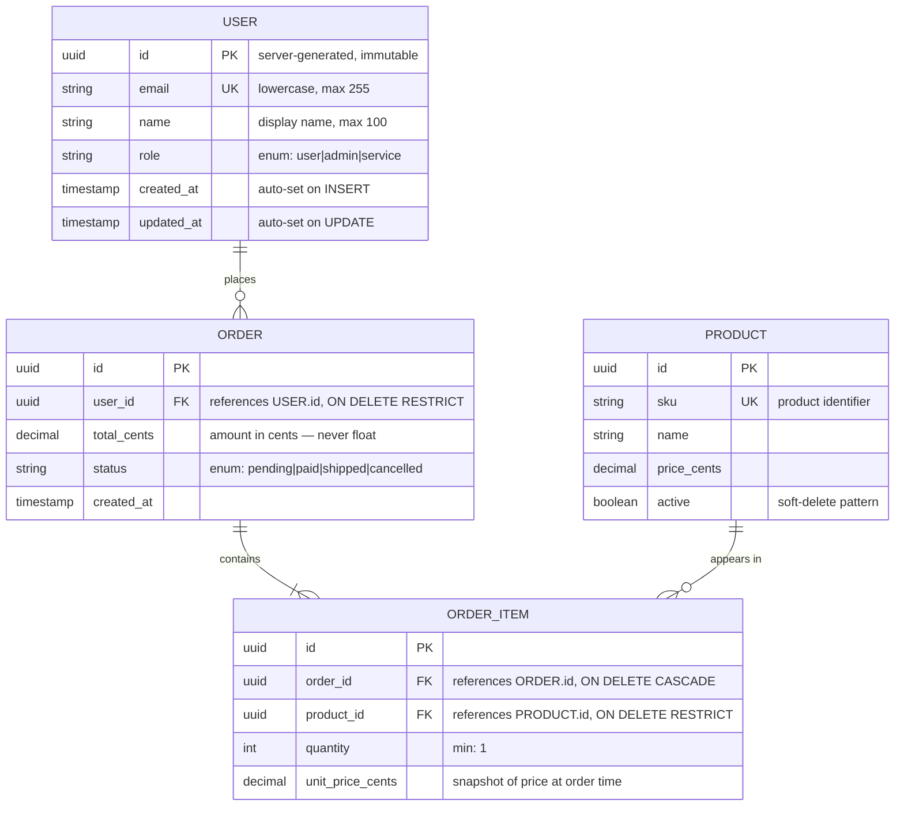

# Database ERD

The HLD Container diagram shows WHAT components exist. Sequence diagrams show HOW they interact. The ERD shows HOW data is structured. Together, these three diagrams form the complete LLD picture before a line of code is written.

## References

- **Mermaid erDiagram** (mermaid.js.org/syntax/entityRelationshipDiagram) — native GitHub rendering, crow's foot notation, PK/FK/UK annotations
- **PostgreSQL CommitFest** — schema migrations reviewed more carefully than code; every migration needs backward-compatibility review
- **Stripe's approach** — zero-downtime migration requires understanding the full schema before writing migration SQL

---

## When to Use

**Required** for any task that:
- Creates a new database table
- Adds or removes columns from an existing table
- Changes relationships between entities
- Has a schema migration file

**Skip** for: config changes, documentation, features with no database interaction, tasks that only add endpoints to an existing schema with no structural changes.

**Infer + confirm:**
> "This adds a new `payments` table and a FK from `orders`. I'll generate an ERD for the schema. OK, or is this schema already documented?"

---

## Mermaid Syntax

### Notation reference

| Symbol | Meaning |
|--------|---------|
| `\|\|` | exactly one |
| `o\|` | zero or one |
| `\|\{` | one or many |
| `o\{` | zero or many |

**Field annotations:** `PK`, `FK`, `UK` (unique key), optional comment string

### Complete example



---

## Process

1. **Read schema sources** — migration files, ORM models, existing ERD if updating
2. **Identify all entities** — one entity per table; include junction tables
3. **Annotate each field** — type, PK/FK/UK, constraints, comment on non-obvious fields
4. **Document relationships** — cardinality with crow's foot notation + label describing the relationship
5. **Add index strategy** — below the diagram, list which fields need indexes and why
6. **Add design rationale** — for non-obvious choices (e.g., "total in cents, not float — avoids floating-point precision errors")
7. **Run `database-erd-reviewer`** — fix Critical and Important findings
8. **Commit** — `.ai/lld/YYYY-MM-DD-<feature>-schema.md`

---

## Output Format

Save to: `.ai/lld/YYYY-MM-DD-<feature>-schema.md`

````markdown
# Database Schema — [Feature Name]

**Date:** YYYY-MM-DD
**Spec:** `.ai/specs/YYYY-MM-DD-<feature>.md`
**HLD:** `.ai/hld/YYYY-MM-DD-<feature>.md`
**Migration files:** [list migration file names]

---

## Entity Relationship Diagram

```mermaid
erDiagram
    [entities and relationships here]
```

---

## Index Strategy

*Indexes that must be created — one row per index. Derived from the query patterns in the spec and HLD.*

| Table | Field(s) | Index type | Query it supports | When to drop |
|-------|---------|-----------|------------------|-------------|
| orders | user_id | B-tree | `SELECT * FROM orders WHERE user_id = ?` | If query removed |
| orders | (status, created_at) | B-tree (composite) | `SELECT * FROM orders WHERE status = ? ORDER BY created_at DESC` | If status filter removed |
| order_items | order_id | B-tree | `SELECT * FROM order_items WHERE order_id = ?` | FK index (auto on some DBs) |

---

## Design Decisions

*Non-obvious schema choices and their rationale. These are ADR-level decisions embedded in the LLD.*

| Decision | Rationale |
|----------|-----------|
| Amounts stored as integers (cents) | Floating-point arithmetic on decimal is unreliable; integer cents eliminates rounding errors |
| `status` as string enum, not integer | Readable in queries and logs; migration to add new value is backward-compatible |
| `user_id` FK with ON DELETE RESTRICT | Prevents orphaned orders; deletion of user requires explicit order cleanup |
| `unit_price_cents` snapshotted on ORDER_ITEM | Product price changes must not retroactively change historical order totals |
| Soft-delete on PRODUCT (`active` flag) | ORDER_ITEM FKs would break with hard delete; inactive products preserved for order history |
````

---

## Self-Review: Run `database-erd-reviewer` Agent

```
Agent(database-erd-reviewer, {
  ERD_PATH: ".ai/lld/YYYY-MM-DD-<feature>-schema.md",
  SPEC_PATH: ".ai/specs/YYYY-MM-DD-<feature>.md"
})
```

Fix all **Critical** findings before committing.
