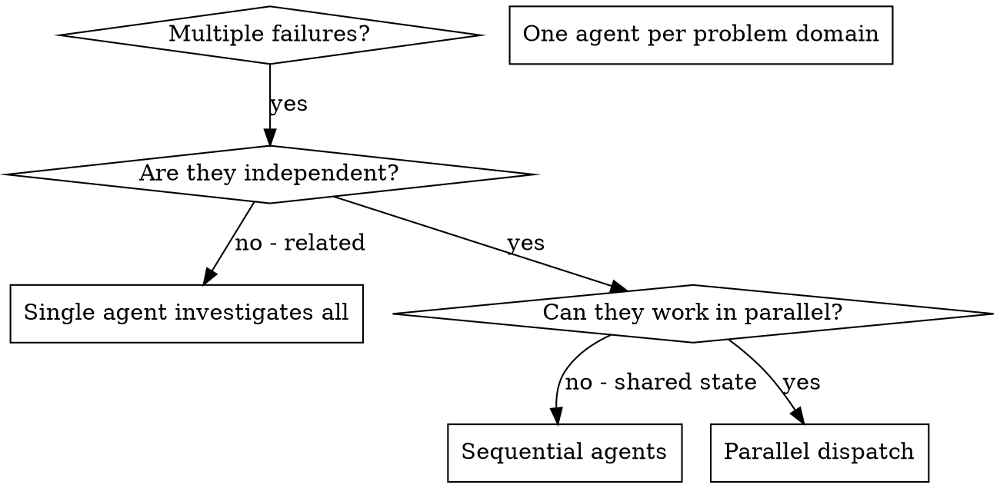

# Dispatching Parallel Agents

## Overview

You delegate tasks to specialized agents with isolated context. By precisely crafting their instructions and context, you ensure they stay focused and succeed at their task. They should never inherit your session's context or history — you construct exactly what they need. This also preserves your own context for coordination work.

When you have multiple unrelated failures (different test files, different subsystems, different bugs), investigating them sequentially wastes time. Each investigation is independent and can happen in parallel.

**Core principle:** Dispatch one agent per independent problem domain. Let them work concurrently.

## When to Use



**Use when:**
- 3+ test files failing with different root causes
- Multiple subsystems broken independently
- Each problem can be understood without context from others
- No shared state between investigations

**Don't use when:**
- Failures are related (fix one might fix others)
- Need to understand full system state
- Agents would interfere with each other

## The Pattern

### 1. Identify Independent Domains

Group failures by what's broken:
- File A tests: Tool approval flow
- File B tests: Batch completion behavior
- File C tests: Abort functionality

Each domain is independent - fixing tool approval doesn't affect abort tests.

### 2. Create Focused Agent Tasks

Each agent gets:
- **Specific scope:** One test file or subsystem
- **Clear goal:** Make these tests pass
- **Constraints:** Don't change other code
- **Expected output:** Summary of what you found and fixed

### 2a. File-Based Handoffs

Pasted context stays resident in your session for every subsequent turn.
Three parallel agents × pasted task text = 3× context growth before you read a result.

- **Task content from a plan:** run `skills/subagent-driven-development/scripts/task-brief PLAN N`,
  pass the printed file path. Agent reads once; you never hold the text.
- **Agent reports:** specify a report file path in each dispatch prompt. Agent writes there;
  you read it after completion. Never paste agent output into later dispatches.
- **Accumulated summaries:** do not paste "state after Agents 1-3" into Agent 4's prompt.
  A fresh agent needs its scope, the file paths it touches, and its constraints. Nothing else.

### 3. Dispatch in Parallel

```typescript
// In Claude Code / AI environment
Task("Fix agent-tool-abort.test.ts failures")
Task("Fix batch-completion-behavior.test.ts failures")
Task("Fix tool-approval-race-conditions.test.ts failures")
// All three run concurrently
```

### 4. Review and Integrate

When agents return:
- Read each summary
- Verify fixes don't conflict
- Run full test suite
- Integrate all changes

## Agent Prompt Structure

**For plan-based tasks, use the handoff pattern:**
```markdown
Read your task brief: [BRIEF_FILE]   ← printed by task-brief script
Write your report to: [REPORT_FILE]  ← uniquely named, never pasted back

[1 line on where this task fits]
[interfaces and decisions from earlier tasks the brief cannot know]
[exact constraints]
```

Good agent prompts are:
1. **Focused** - One clear problem domain
2. **Self-contained** - All context needed to understand the problem
3. **Specific about output** - What should the agent return?

```markdown
Fix the 3 failing tests in src/agents/agent-tool-abort.test.ts:

1. "should abort tool with partial output capture" - expects 'interrupted at' in message
2. "should handle mixed completed and aborted tools" - fast tool aborted instead of completed
3. "should properly track pendingToolCount" - expects 3 results but gets 0

These are timing/race condition issues. Your task:

1. Read the test file and understand what each test verifies
2. Identify root cause - timing issues or actual bugs?
3. Fix by:
   - Replacing arbitrary timeouts with event-based waiting
   - Fixing bugs in abort implementation if found
   - Adjusting test expectations if testing changed behavior

Do NOT just increase timeouts - find the real issue.

Return: Summary of what you found and what you fixed.
```

## Coordinating a Long-Lived Fleet (3+ agents)

Short parallel bursts (fix N test files, return) need no coordinator — dispatch, collect, integrate. But when 3+ agents run **long-lived** on the same repo, you need one coordination-only role holding a shared board. This is a portable file-ledger — no external coordination service required, works anywhere.

**Board file:** `.ai/sdd/board.md` (same scratch dir subagent-driven-development uses; self-ignored by git).

**Each worker writes a heartbeat block** (never broadcasts to peers):

```markdown
## agent-<id>
last_progress: <what just finished>
next_action: <what it will do next>
blocked_on: <dependency or none>
verification_status: <untested | tests-green | review-pending>
file_claims: <paths this agent is actively editing>
updated: <timestamp>
```

**One coordinator agent** (coordination only — never implements):
1. Reads all heartbeat blocks each cycle.
2. Renders a single canonical board — one write, not peer-to-peer broadcast flooding.
3. Detects **file-claim collisions** — two agents claiming the same path → serialize them.
4. Nudges a stale agent privately (no board spam) when its `updated` is old.
5. Escalates to the human **only** true blockers — a `blocked_on` no agent can clear.

Rule: the board is the single source of truth. Workers read it before claiming files; the coordinator is the only writer of the rendered board. This replaces N² peer chatter with one read + one write per cycle.

## Common Mistakes

**❌ Pasting task text inline:** context grows with every agent dispatched; brief files eliminate this
**✅ Use task-brief script:** pass the path — agent reads once, you never hold it

**❌ Pasting accumulated summaries:** "state after Agents 1-3 is..." creates megaprompts
**✅ Pass file paths:** each agent reads only what it needs

**❌ Too broad:** "Fix all the tests" - agent gets lost
**✅ Specific:** "Fix agent-tool-abort.test.ts" - focused scope

**❌ No context:** "Fix the race condition" - agent doesn't know where
**✅ Context:** Paste the error messages and test names

**❌ No constraints:** Agent might refactor everything
**✅ Constraints:** "Do NOT change production code" or "Fix tests only"

**❌ Vague output:** "Fix it" - you don't know what changed
**✅ Specific:** "Return summary of root cause and changes"

## When NOT to Use

**Related failures:** Fixing one might fix others - investigate together first
**Need full context:** Understanding requires seeing entire system
**Exploratory debugging:** You don't know what's broken yet
**Shared state:** Agents would interfere (editing same files, using same resources)

## Real Example from Session

**Scenario:** 6 test failures across 3 files after major refactoring

**Failures:**
- agent-tool-abort.test.ts: 3 failures (timing issues)
- batch-completion-behavior.test.ts: 2 failures (tools not executing)
- tool-approval-race-conditions.test.ts: 1 failure (execution count = 0)

**Decision:** Independent domains - abort logic separate from batch completion separate from race conditions

**Dispatch:**
```
Agent 1 → Fix agent-tool-abort.test.ts
Agent 2 → Fix batch-completion-behavior.test.ts
Agent 3 → Fix tool-approval-race-conditions.test.ts
```

**Results:**
- Agent 1: Replaced timeouts with event-based waiting
- Agent 2: Fixed event structure bug (threadId in wrong place)
- Agent 3: Added wait for async tool execution to complete

**Integration:** All fixes independent, no conflicts, full suite green

**Time saved:** 3 problems solved in parallel vs sequentially

## Key Benefits

1. **Parallelization** - Multiple investigations happen simultaneously
2. **Focus** - Each agent has narrow scope, less context to track
3. **Independence** - Agents don't interfere with each other
4. **Speed** - 3 problems solved in time of 1

## Verification

After agents return:
1. **Review each summary** - Understand what changed
2. **Check for conflicts** - Did agents edit same code?
3. **Run full suite** - Verify all fixes work together
4. **Spot check** - Agents can make systematic errors
