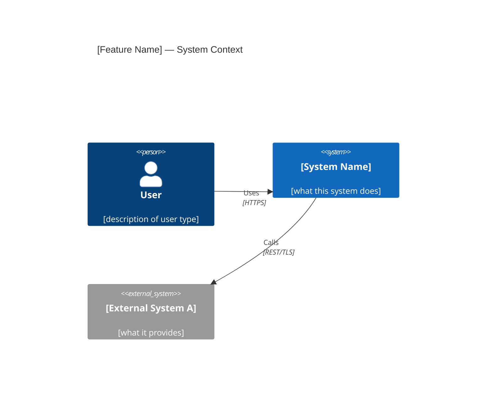
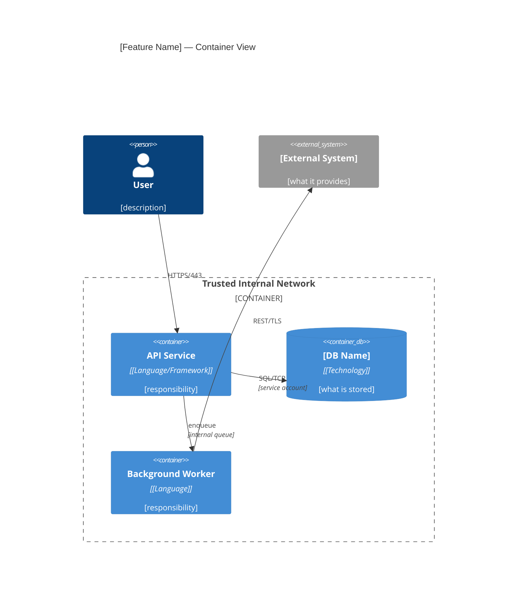

# High Level Design

Translate a validated spec into a committed architectural blueprint. Architecture decisions made here become permanent record — not conversation, not memory. The HLD is the contract between design and implementation.

## References

- **C4 Model** (Simon Brown, c4model.com) — Context + Container diagrams as the minimum visual contract
- **Google Design Doc** (industrialempathy.com/posts/design-docs-at-google) — Context, Goals/Non-Goals, Actual Design, Alternatives, Cross-Cutting Concerns
- **AWS Threat Modeling** (Shostack 4-Question Frame + STRIDE) — design-time security analysis
- **Michael Nygard / MADR ADR format** — immutable decision records
- **AWS Well-Architected Framework** — 6 pillars for cross-cutting review
- **Google SRE SLO document** — capacity and SLO structure

---

## When to Use

**Required** for new architectural elements: new service/process, new data model, new external integration, security boundary changes, traffic-bearing endpoints with capacity requirements.

**Skip** for: bug fixes, config changes, isolated utilities, adding a method/parameter/parsing capability to an existing component, new endpoint following an established service pattern.

**Infer + confirm before proceeding.** Don't silently skip — state the inference and ask once:
> "This adds array parsing to an existing parser — no new service, no data model change, no external dependency. I'm going to skip HLD. Correct, or am I missing something?"

Use `AskUserQuestion` when the scope is ambiguous (feature could be small or large depending on implementation approach).

---

## Inputs Required

- **Spec:** `.ai/specs/YYYY-MM-DD-<feature>.md` — must have passed `spec-quality-gate`
- **Business context:** `.ai/specs/business-context.md` — read if exists

Read both. Extract: NFRs (latency/throughput/availability), security requirements, compliance constraints, component dependencies from REQ-NNN statements.

<HARD-GATE>
Do NOT activate without a spec that has passed spec-quality-gate. If no spec exists, stop and invoke brainstorming first.
</HARD-GATE>

---

## Process

1. **Read spec and business context** — extract NFRs, security requirements, compliance, dependencies
2. **Ask clarifying architecture questions** — one at a time, multiple choice preferred
3. **Present component decomposition** — boxes and arrows; for each proposed component name what it hides (the design decision or volatile requirement other components must not know about); get approval before diagramming
4. **Generate C4 diagrams** — Context (Level 1) then Container (Level 2) in Mermaid
5. **Document technology selections** — one entry per major component with rationale
6. **Threat model** — Shostack 4 questions + STRIDE per component
7. **Failure mode analysis** — per component: what fails, user impact, mitigation, recovery target
8. **Capacity planning** — 3 scenarios from NFRs: pessimistic / expected / optimistic
9. **Identify ADR candidates** — every significant "why X over Y" decision
10. **Write ADR files** — one per decision, committed to `wiki/architecture/`
11. **Write HLD document** — all sections assembled, committed to `.ai/hld/`
12. **Run `hld-reviewer` agent** — fix all Critical and Important findings before presenting
13. **Human review gate** — present for approval. Do NOT invoke `writing-plans` until approved.
14. **Resolve open questions** — all must be decided or explicitly deferred before `writing-plans`

---

## Architecture Questions (One at a Time)

Ask only what meaningfully changes the design. Stop when you can draw the boxes:

- "What environment does this run in? (single process / microservices / serverless / embedded)"
- "Which data stores exist or are being added?" (for each: relational, document, cache, object store, queue)
- "What external systems does this integrate with — and who owns them?"
- "Who are the callers? (human users / other internal services / scheduled jobs / event triggers)"
- "Are there existing services this must not break? What are their contracts?"
- "What's the expected peak RPS / data volume / concurrent users?" (if not in NFRs)
- "Where does authentication happen — at the edge, in this service, or delegated?"

---

## HLD Document Format

Save to: `.ai/hld/YYYY-MM-DD-<feature>.md`

````markdown
# [Feature Name] — High Level Design

**Date:** YYYY-MM-DD
**Spec:** `.ai/specs/YYYY-MM-DD-<feature>.md`
**Status:** Draft | Under Review | Approved
**Reviewers:** [names]
**Approved by:** [name] on [date]

---

## 1. Context and Scope

[Why this system is being built. What problem it solves. Where it sits in the broader ecosystem. 2–3 paragraphs. Objective facts only — no opinions, no rationale. Per Google Design Doc: "rough overview of the landscape in which the new system is being built."]

---

## 2. Goals and Non-Goals

**Goals:**
- [What this design achieves — specific and measurable where possible]

**Non-Goals:**
- [What this design explicitly does NOT address — state what could be assumed but isn't in scope]

*Non-goals are as important as goals. They prevent scope creep and misaligned review feedback.*

---

## 3. System Diagrams (C4 Model)

### 3.1 Context — C4 Level 1

> Actors and systems that interact with the system being designed.



### 3.2 Containers — C4 Level 2

> Internal runtime components: services, databases, queues, and their relationships. Trust boundaries annotated here.



| Container | Technology | Responsibility |
|-----------|------------|---------------|
| API Service | [Language + Framework] | [one sentence] |
| [DB Name] | [Technology + version] | [one sentence] |

---

## 4. Technology Selection

*Per Stripe's API design practice: every non-obvious choice is documented with why alternatives were rejected.*

| Component | Technology | Rationale | Alternatives Considered |
|-----------|------------|-----------|------------------------|
| Web framework | [name + version] | [specific property that made it the choice] | [alternative]: [specific rejection reason] |
| Primary datastore | [name + version] | [specific property] | [alternative]: [specific rejection reason] |
| Message queue | [name + version] | [specific property] | [alternative]: [specific rejection reason] |
| Auth | [mechanism] | [specific property] | [alternative]: [specific rejection reason] |

*If an alternative was not seriously considered, omit that row — do not invent alternatives for appearance.*

---

## 5. The Actual Design

*Per Google Design Doc: "emphasis on trade-offs." Not implementation detail — the shape of the solution and why.*

### 5.1 API Surface

[Key endpoints — method, path, purpose. Not a full OpenAPI spec — that belongs in `api-contract-first`. The shape that drives architectural constraints: sync vs async, request payload size, response latency budget.]

### 5.2 Data Model

[Entities, relationships, key constraints. Not a full schema — the conceptual model that determines storage selection and query patterns.]

### 5.3 Key Flows

[For any operation touching 3+ components, describe the sequence: who calls whom, in what order, what data crosses the boundary, what happens on failure at each step.]

---

## 6. Security Architecture

*Based on AWS threat modeling: Shostack 4-Question Frame + STRIDE per component.*

### 6.1 What Are We Working On?
[Data classification: what sensitive data does this system handle? PII / PCI / internal / public. Where does it flow?]

### 6.2 Threat Model (STRIDE)

| Threat | Component | Risk | Mitigation |
|--------|-----------|------|-----------|
| **S**poofing | [API Service] | [Can callers impersonate others?] | [JWT RS256 with issuer validation] |
| **T**ampering | [DB] | [Can data be modified in transit?] | [TLS 1.3 in transit, integrity constraint at DB] |
| **R**epudiation | [API Service] | [Can actions be denied?] | [Audit log with immutable append-only store] |
| **I**nformation Disclosure | [Worker] | [Can data leak to unauthorized callers?] | [Secret manager, no secrets in env output] |
| **D**enial of Service | [API Service] | [Can service be overwhelmed?] | [Rate limiting at edge, connection pool cap] |
| **E**levation of Privilege | [Auth layer] | [Can low-privilege user gain higher access?] | [RBAC with explicit allow-list, no wildcard grants] |

### 6.3 Security Controls

| Concern | Decision | Rationale |
|---------|----------|-----------|
| Authentication | [JWT RS256 / OAuth2 / API key / mTLS] | [specific reason] |
| Authorization | [RBAC / ABAC / capability-based] | [specific reason] |
| Encryption at rest | [AES-256 via managed key / field-level / none + justification] | [specific reason] |
| Encryption in transit | [TLS 1.3 minimum] | [standard] |
| Secret management | [vault / KMS / env vars via CI secret store] | [specific reason] |
| Data classification | [PII fields: list them / no PII] | [regulatory driver if any] |

**Trust boundaries:** Annotated on C4 Container diagram above (dashed line = trust boundary crossing).

### 6.4 Did We Do a Good Job? (Verification)
- [ ] All STRIDE threats have documented mitigations
- [ ] All PII fields identified and encrypted at rest
- [ ] No secrets in code, config files, or logs
- [ ] Auth enforced at every external-facing entry point
- [ ] Least-privilege service accounts for all components

---

## 7. Failure Mode Analysis

*Per AWS Well-Architected Reliability pillar: design for failure, not around it.*

| Component | Failure Mode | User Impact | Mitigation | Recovery Target |
|-----------|-------------|-------------|------------|-----------------|
| API Service | Process crash | All requests fail (5xx) | Health check + auto-restart (k8s/systemd) | < 30s |
| [DB] | Connection exhaustion | Writes fail | Connection pool (max N) + circuit breaker | < 5s |
| [Worker] | Job stuck | Delayed processing | Dead letter queue + alert after N retries | < 5 min |
| [External System] | Unavailable | Dependent feature fails | Circuit breaker + graceful degradation fallback | < 1 min |

---

## 8. Capacity Planning

*Based on NFRs from spec. Three scenarios per AWS/SRE practice. Scaling triggers at 70%/80% utilization.*

| Metric | Source | Pessimistic | Expected | Optimistic |
|--------|--------|-------------|----------|------------|
| RPS (sustained) | NFR | [0.5× target] | [target] | [2× target] |
| RPS (peak) | NFR | [1.5× expected] | [2× expected] | [3× expected] |
| DB rows / data volume | estimate | [low] | [mid] | [high] |
| p99 latency budget | NFR | [target] | [target] | [target] |
| Concurrent connections | derived | [low] | [mid] | [high] |

**Scaling triggers:**
- 70% capacity: begin preparation (provision lead time)
- 80% capacity: initiate scaling action
- 85% sustained: never exceed in production

**Scaling strategy per dimension:**
| Metric | Trigger | Action |
|--------|---------|--------|
| CPU (API pods) | > 70% avg 5 min | Horizontal pod autoscaling |
| DB connections | > 80% pool | Increase pool / add read replica |
| Storage | > 70% | Pre-provision + alert |

---

## 9. Cross-Cutting Concerns & Quality-Attribute Scenarios

*AWS Well-Architected 6 Pillars — address each explicitly or state "not
applicable + reason." For each applicable pillar, give a **measurable
quality-attribute scenario** (ATAM), not a vibe: a concrete stimulus →
measurable response, so the architecture is verifiable against it.*

| Pillar | Addressed? | Quality-attribute scenario (stimulus → measurable response) |
|--------|-----------|-------------|
| Operational Excellence | [Yes/Partial/No] | [e.g. "an alert fires → on-call has a runbook that resolves it in < 15 min"] |
| Security | [Yes] | [See §6 — STRIDE mitigations] |
| Reliability | [Yes] | [e.g. "one AZ fails → service stays up, error rate < 0.1%" — see §7] |
| Performance Efficiency | [Yes/Partial/No] | [e.g. "p99 read latency < 200ms at 10× current load"] |
| Cost Optimization | [Yes/Partial/No] | [estimated monthly infra cost at expected load] |
| Sustainability | [Yes/Partial/No] | [any energy / carbon considerations] |

**Sensitivity & tradeoff points (ATAM):** name the decisions that strongly move
one attribute (sensitivity points) and the ones where improving one attribute
hurts another (tradeoff points) — e.g. "synchronous replication buys durability
but costs write latency." These are what the ADRs must justify.

**Stakeholder concern → view traceability (ISO/IEC/IEEE 42010):** confirm each
stakeholder concern (from §1) is answered by at least one view — the C4 Context
view for scope concerns, the Container view for deployment/interaction concerns,
§5 for data/flow concerns, §6 for security concerns. A concern no view addresses
is a hole in the design, not just the document.

---

## 10. Alternatives Considered

*Per Google Design Doc: "describe viable alternatives and the reasons for picking the proposed design over them."*

| Alternative | Why Rejected |
|-------------|-------------|
| [Approach B] | [Specific property it lacks that the chosen design has — not "worse" in general] |
| [Approach C] | [Specific trade-off that makes it unsuitable for this context] |

---

## 11. Open Questions

*Unresolved design decisions. All must be resolved or explicitly deferred before `writing-plans` activates.*

| Question | Owner | Decision Deadline | Impact if Unresolved |
|----------|-------|-------------------|---------------------|
| [specific question] | [name] | YYYY-MM-DD | [what gets blocked or decided incorrectly] |

---

## 12. Architecture Decision Records

| ADR | Decision | Status |
|-----|----------|--------|
| [ADR-NNN-title.md](../wiki/architecture/ADR-NNN-title.md) | [one-line decision] | Accepted |
````

---

## ADR Format

Save each to: `wiki/architecture/ADR-NNN-<kebab-title>.md`

ADR numbering is global and monotonic across the project — check existing ADRs before assigning a number.

````markdown
# ADR-NNN: [Decision Title]

**Status:** Proposed | Accepted | Rejected | Deprecated | Superseded by ADR-NNN
**Date:** YYYY-MM-DD

## Context and Problem Statement

[What forces are at play? What constraints exist? What problem triggered this decision?
Be specific — the context explains why this decision was non-obvious and why a reasonable engineer could have picked differently.]

## Considered Options

- **Option A:** [name — one sentence]
- **Option B:** [name — one sentence]
- **Option C:** [name — one sentence]

## Decision Outcome

**Chosen: Option A** — [one sentence rationale tied to a specific property required by the spec or NFRs]

### Consequences

**Positive:**
- [specific benefit]

**Negative:**
- [specific trade-off — not "it's harder" but "requires X which costs Y"]

**Neutral:**
- [observation about the decision's implications]

## Options Analysis

| Option | Key Strength | Key Weakness | Eliminated Because |
|--------|-------------|--------------|-------------------|
| A (chosen) | [specific strength] | [acknowledged weakness] | — |
| B | [specific strength] | [specific weakness] | [specific disqualifying property] |
| C | [specific strength] | [specific weakness] | [specific disqualifying property] |
````

**ADR rules (from Nygard / AWS):**
- ADRs are **immutable once Accepted**. If a decision changes, supersede — do not edit.
- To supersede: add `**Superseded by:** ADR-NNN` at the top, change status to `Superseded`.
- One decision per ADR. Compound decisions get two ADRs.
- Status values: `Proposed → Accepted | Rejected | Deprecated | Superseded by ADR-NNN`

---

## What Requires an ADR

Write an ADR for every choice where a reasonable engineer could pick differently AND changing it later costs significant rework:

| Category | ADR triggers |
|----------|-------------|
| Storage | Database engine, caching layer, object store, queue technology |
| Communication | Sync vs async between components, REST vs gRPC vs event-driven |
| Auth/authz | Auth mechanism, authorization model (RBAC vs ABAC) |
| Data | Partitioning strategy, consistency model, retention policy |
| Infrastructure | Hosting platform, IaC tool, deployment strategy |
| External | Any third-party dependency whose API you build against |
| Error handling | Retry strategy, DLQ design, graceful degradation policy |

---

## Reviewer Dispatch Discipline

When dispatching the reviewer agent:
- Pass artifact as a file path, not pasted content — pasted reviewer reports stay resident in context for the rest of the session
- Do not pre-judge findings — never instruct the reviewer to ignore or not flag a specific issue, and never pre-rate severity ("treat X as Minor at most")
- If the reviewer returns findings: dispatch ONE fix agent with the complete findings list, not one fixer per finding
- Re-dispatch the same reviewer after fixes; repeat until PASS
- A ⚠️ item from the reviewer is yours to resolve — you hold cross-document context the reviewer lacks; treat confirmed gaps as a failed review

## Self-Review: Run `hld-reviewer` Agent

After writing the HLD and ADRs, before presenting to human:

```
Agent(hld-reviewer, {
  HLD_PATH: ".ai/hld/YYYY-MM-DD-<feature>.md",
  SPEC_PATH: ".ai/specs/YYYY-MM-DD-<feature>.md"
})
```

Fix all **Critical** and **Important** findings before presenting. Advisory findings may be deferred with explicit acknowledgment.

---

## Human Approval Gate

After `hld-reviewer` passes, present to human:

> "HLD committed to `.ai/hld/YYYY-MM-DD-<feature>.md`. ADRs committed to `wiki/architecture/`. `hld-reviewer` passed with [N advisory findings — listed below].
>
> Key decisions made: [list 3–5 most consequential ADRs].
>
> Open questions remaining: [list, or 'none'].
>
> Please review and approve before I proceed to `writing-plans`."

<HARD-GATE>
Do NOT invoke writing-plans until the human explicitly approves the HLD. Silence is not approval.
</HARD-GATE>

If the human requests changes: update HLD and affected ADRs, re-run `hld-reviewer`, re-present.

---

## Transition to `writing-plans`

After explicit human approval:

1. Confirm all Open Questions are resolved or explicitly deferred with acknowledgment
2. Note the HLD path in the `writing-plans` invocation — every plan task should trace to a container in the C4 diagram
3. Invoke `writing-plans` skill

The HLD becomes the authoritative reference for implementation task design. If a `writing-plans` task cannot be traced to a component in the Container diagram, either add the component to the HLD or remove the task from the plan.

**Data model note:** §5.2 (Data Model) describes entities and relationships conceptually. For any feature with database changes, invoke `database-erd` skill to produce the formal Mermaid erDiagram with all entities, FK annotations, cardinality, index strategy, and design decisions. Saved to `.ai/lld/` alongside sequence diagrams.

**API surface note:** §5.1 defines the API surface conceptually. Before any handler task is defined in `writing-plans`, invoke `api-contract-first` skill to produce the formal OpenAPI 3.1 or `.proto` contract. The handler task references the spec — not the HLD — as its implementation contract.

**Sequence diagram note:** For any flow crossing 3+ components or involving auth/async patterns, invoke `sequence-diagram` skill after the Container diagram is complete. Sequence diagrams show HOW components communicate; the Container diagram shows WHAT exists. Together they form the complete LLD picture.
