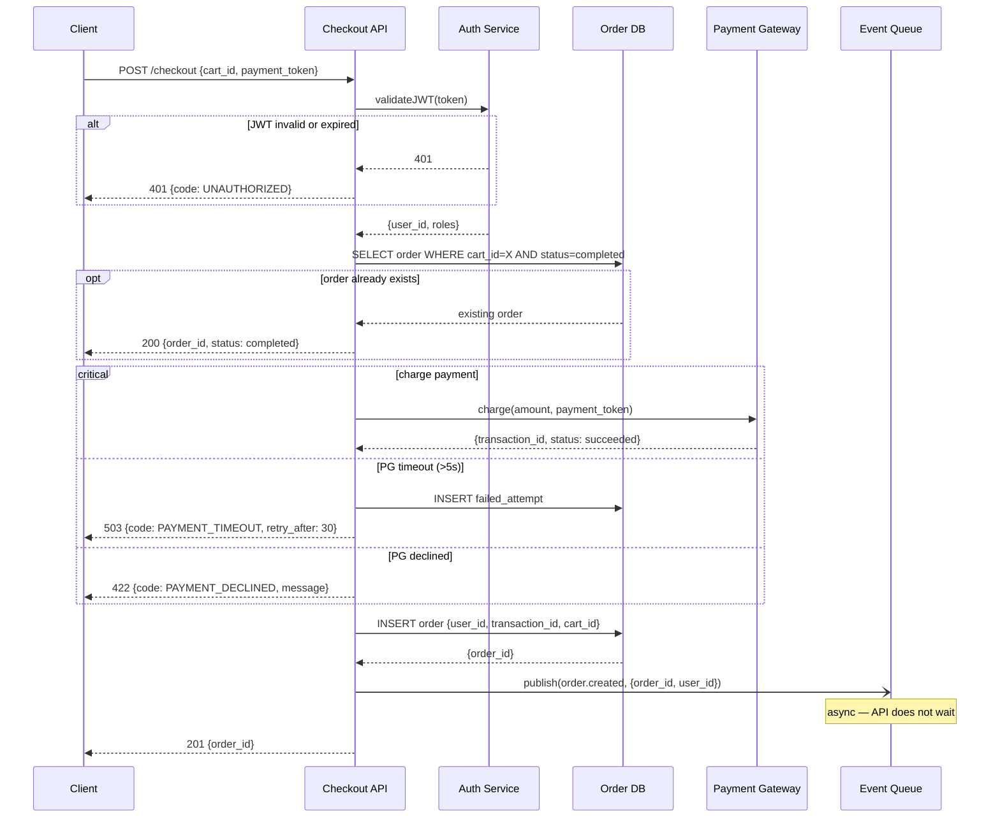

# Sequence Diagrams

C4 Container diagrams show **what** exists. Sequence diagrams show **how** things talk to each other. The two together answer every question a new engineer has about a system.

## References

- **Netflix practice** — sequence diagrams mandatory for any operation crossing service boundaries; "draw the sequence diagram first" before any new microservice interaction
- **Google Design Doc** — §3 "The Actual Design" includes sequence diagrams for critical paths alongside API sketches
- **Mermaid** (mermaid.js.org/intro/syntax-reference) — `sequenceDiagram` with full UML control flow: `alt`/`else`, `loop`, `par`, `opt`, `critical`, `break`

---

## When to Use

**Required** for any flow that:
- Crosses 3 or more components from the HLD Container diagram
- Involves auth/authz (who validates the token, where)
- Has a retry or circuit breaker requirement
- Has async messaging (queue, event bus)
- Is in a critical user path (auth, checkout, payment, core CRUD)

**Skip** for: internal function calls within a single component, simple 2-party request-response with no error handling, pure read paths with no auth.

**Infer + confirm:**
> "This adds a parser utility — single component, no service boundaries. Skipping sequence diagrams. OK?"

---

## When to Invoke

- During `high-level-design` §5.1 (API Surface) — after Container diagram is drawn
- During `writing-plans` — before defining handler tasks that cross services
- Any time `api-contract-first` reveals a multi-service flow

---

## Process

1. **Read HLD Container diagram** — list all participants (services, DBs, queues, external systems)
2. **Read spec REQ-NNN** — identify ACs with cross-component behavior ("system calls X", "service notifies Y")
3. **Identify critical flows** — prioritize: auth flows, payment/mutation flows, async patterns, error paths
4. **Draft sequence per flow** — one diagram per distinct interaction pattern (not per endpoint)
5. **Run `sequence-diagram-reviewer`** — fix Critical findings
6. **Commit** alongside the HLD

---

## Mermaid Syntax Reference

### Core patterns

```
sequenceDiagram
    %% Declare participants explicitly — controls left-to-right order
    participant Client
    participant API as API Service
    participant Auth as Auth Service
    participant DB as PostgreSQL
    participant Queue as RabbitMQ

    %% Sync request → response
    Client->>API: POST /checkout (JWT)
    API->>Auth: validate(token)
    Auth-->>API: {user_id, roles}

    %% Error path
    alt token invalid
        Auth-->>API: 401 Unauthorized
        API-->>Client: 401 {code: UNAUTHORIZED}
    end

    %% Async fire-and-forget
    API-)Queue: publish(order.created)
    Queue-->>API: ack

    %% DB write with error handling
    API->>DB: INSERT order
    DB-->>API: order_id

    API-->>Client: 201 {order_id}
```

### Full control-flow blocks

```
sequenceDiagram
    participant Client
    participant API
    participant DB

    %% Optional block (may or may not execute)
    opt cache miss
        API->>DB: SELECT user WHERE id=X
        DB-->>API: user row
    end

    %% Loop (polling, pagination)
    loop retries (max 3)
        API->>ExternalService: call()
        alt success
            ExternalService-->>API: 200
        else transient error
            ExternalService-->>API: 503
            Note over API: wait 2^n seconds
        end
    end

    %% Parallel (concurrent calls)
    par fetch user AND fetch inventory
        API->>UserDB: SELECT user
    and
        API->>InventoryDB: SELECT items
    end

    %% Critical region (must not be interrupted)
    critical payment processing
        API->>PaymentGateway: charge(amount)
        PaymentGateway-->>API: {transaction_id}
    option timeout
        API->>DB: INSERT failed_payment
        API-->>Client: 503 {code: PAYMENT_TIMEOUT}
    end

    %% Break (early exit)
    break authorization fails
        API-->>Client: 403 Forbidden
    end
```

### Arrow types

| Arrow | Meaning |
|-------|---------|
| `A->>B: message` | Synchronous request (solid line) |
| `A-->>B: message` | Synchronous response (dashed line) |
| `A-)B: message` | Async, fire-and-forget (solid, open arrowhead) |
| `A--)B: message` | Async response/callback (dashed, open) |
| `A-xB: message` | Failed message / error |

---

## Output Format

Save to: `.ai/lld/YYYY-MM-DD-<feature>-sequences.md`

````markdown
# Sequence Diagrams — [Feature Name]

**Date:** YYYY-MM-DD
**HLD:** `.ai/hld/YYYY-MM-DD-<feature>.md`
**Spec:** `.ai/specs/YYYY-MM-DD-<feature>.md`

---

## Flow 1: [Name — e.g., "Authenticated Checkout"]

*Participants: Client → API → Auth → OrderDB → PaymentGateway → Queue*



**What this diagram shows:** Token validation location, idempotency check, payment critical region with two failure modes, async event publish without blocking the response.

---

## Flow 2: [Next critical flow]

[...]
````

---

## Self-Review: Run `sequence-diagram-reviewer` Agent

```
Agent(sequence-diagram-reviewer, {
  DIAGRAM_PATH: ".ai/lld/YYYY-MM-DD-<feature>-sequences.md",
  HLD_PATH: ".ai/hld/YYYY-MM-DD-<feature>.md",
  SPEC_PATH: ".ai/specs/YYYY-MM-DD-<feature>.md"
})
```

Fix all **Critical** findings before committing.
