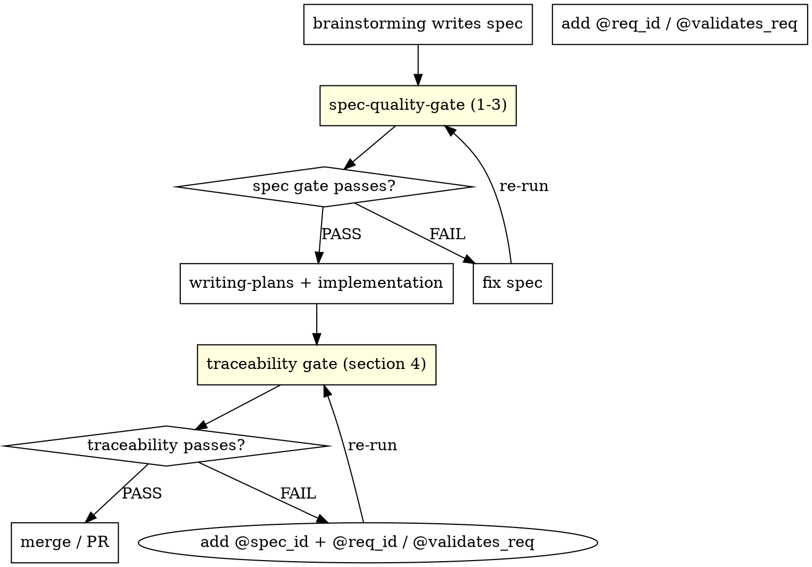

# Spec Quality Gate

Linter for specs. Run after brainstorming writes the spec, before writing-plans starts.

**Core principle:** A spec that passes human review but fails the quality gate is not a spec — it is a wish list.

## The Iron Law

```
NO PLAN WITHOUT A PASSING QUALITY GATE FIRST
```

If the gate fails, fix the spec. Do not proceed to writing-plans.

## Gate Execution Order

Run deterministic checks first (mechanical, no judgment). Then run structural checks. Then run logic checks. Report all failures before asking for fixes.

---

## Spec Identity

Every spec file must begin with a YAML frontmatter block assigning a globally unique `spec_id`.

**Format:** `SPEC-N` (no zero-padding, e.g., `SPEC-1`, `SPEC-42`)

```markdown
---
spec_id: SPEC-1
title: User Authentication
status: approved
---
```

`spec_id` is the root of the traceability chain:
```
SPEC-N → REQ-NNN → @spec_id + @req_id (code) → @spec_id + @validates_req (tests)
```

---

## 1. Deterministic Checks (automated — run these first)

Search the spec file for each pattern. Flag every match.

### 1a. Vague / Emotional Language (ZERO TOLERANCE)

```bash
# Run against spec file — any match = FAIL
grep -niE \
  "tbd|todo|somehow|appropriate(ly)?|intuitive|clean|nice|good performance|fast enough|user.?friendly|should work|seamless|simple(ly)?|obvious|easy to use|high.?quality" \
  <spec-file>
```

Every match is a blocking failure. Replace with a measurable criterion.

**Examples of forbidden → required rewrites:**

| Forbidden | Required |
|-----------|---------|
| "must be fast" | "p99 latency < 200ms under 100 concurrent requests" |
| "should be intuitive" | "new user completes task X without documentation in < 3 minutes" |
| "good error handling" | "all error paths return structured error with code, message, and retry hint" |
| "TBD" | Specific value or explicit deferral with rationale |

### 1b. Requirement ID Coverage

Every requirement block must start with `REQ-NNN:`. Count IDs and verify sequential, no gaps.

```bash
grep -c "^### REQ-[0-9]" <spec-file>   # count
grep "^### REQ-[0-9]" <spec-file>       # list — check for gaps
```

### 1c. Mandatory Subsections Per Requirement

Each `### REQ-NNN` block must contain all four:

```bash
# For each REQ block, verify presence of:
# - "**Statement:**"
# - "**Acceptance Criteria:**"
# - "**Dependencies:**" (may be "None" explicitly)
# - "**Test Cases:**"
```

Missing any subsection = FAIL for that REQ.

### 1d. Test Coverage Matrix Present

```bash
grep -c "## Test Coverage Matrix" <spec-file>
```

Must be exactly 1. Missing = FAIL.

### 1e. Out of Scope Section Present

```bash
grep -c "## Out of Scope" <spec-file>
```

Must be exactly 1. Missing = FAIL. Empty = FAIL.

### 1f. spec_id Present and Valid Format

```bash
# Must appear in frontmatter (first 10 lines)
head -10 <spec-file> | grep -E "^spec_id: SPEC-[1-9][0-9]*$"
```

Missing or malformed spec_id = FAIL. Valid: `SPEC-1`, `SPEC-42`. Invalid: `SPEC-001`, `spec-1`, `SPEC-0`.

### 1g. spec_id Globally Unique

```bash
# Across all spec files
grep -rh "^spec_id:" .ai/specs/ | sort | uniq -d
```

Any duplicate = FAIL. Each spec must have a unique SPEC-N that is never reused, even after a spec is retired.

---

## 2. Structural Checks (judgment required)

### 2a. Acceptance Criteria Are Measurable

For every acceptance criterion line (`- [ ]`), verify it contains at least one of:
- A number, threshold, or count (e.g., `< 200ms`, `>= 99.9%`, `exactly 3 retries`)
- A binary condition with specific inputs and outputs (e.g., "returns HTTP 401 when token is expired")
- A reference to a deterministic comparison (e.g., "output matches fixture in `tests/fixtures/expected.json`")

Criteria that are purely qualitative → FAIL.

### 2b. Dependency Assumed Behaviors

Every entry in a `**Dependencies:**` table must have a non-empty "Assumed Behavior" column. "N/A" is acceptable only for internal utilities with no external surface. "Assumed to work" is NOT acceptable.

**Good:**
```
| Redis | Returns cached value within 1ms on hit; returns nil on miss |
```

**Bad:**
```
| Redis | Assumed to work |
```

### 2c. Test Cases Are Named, Not Generic

Every `- TC-` entry must have a descriptive name (not "test case 1", "happy path").

### 2d. No Orphaned Test Cases

Every test case ID in the Test Coverage Matrix must appear in exactly one `REQ-NNN` block's Test Cases list. Orphaned TCs (in matrix but not in a REQ) = FAIL.

---

## 3. Logic Checks

### 3a. Dependencies Have Their Own REQs or Are External

If a dependency is internal (a component in this system), it must have its own `REQ-NNN` block. If external, it must appear in the Assumptions table.

### 3b. Requirements Are Independent

Each REQ must be implementable without implementing all other REQs simultaneously. If REQ-003 can only be tested after REQ-001 and REQ-002 are complete, mark it explicitly:

```
**Depends on:** REQ-001, REQ-002
```

### 3c. Requirements Are Complete — No Implicit Behavior

If the spec says "returns user data on success", it must also specify what happens on failure. Every happy path REQ must have a corresponding error/edge REQ or explicitly state "error handling covered by REQ-NNN".

---

## 4. Code Traceability Checks (run after implementation, before merge)

These checks are **post-implementation**. Run them after code exists — not at spec time.

**Required on every public construct (Tier 1–5 per code-documentation skill):**
- `@spec_id SPEC-N` — which spec this construct implements
- `@req_id REQ-NNN` — which requirement within that spec

**Required on every test unit (Tier 6):**
- `@spec_id SPEC-N` — which spec is being validated
- `@validates_req REQ-NNN` — which requirement within that spec

**No exemptions.** Every written construct must trace to a spec and requirement. If it exists in the codebase, a spec must exist for it.

### 4a. Every REQ Has At Least One Code Annotation

Scan all source files (language-agnostic). Exclude non-source dirs and config/data files.

```bash
# Find all spec_id annotations in source (language-agnostic)
grep -rn "spec_id: SPEC-\|@spec_id SPEC-" \
  --exclude-dir=".git" --exclude-dir="node_modules" --exclude-dir="vendor" \
  --exclude-dir="dist" --exclude-dir="build" --exclude-dir=".ai" \
  --exclude="*.json" --exclude="*.yaml" --exclude="*.yml" \
  --exclude="*.toml" --exclude="*.md" --exclude="*.lock" \
  <src-dir>

# Find all req_id annotations in source
grep -rn "req_id: REQ-\|@req_id REQ-" \
  --exclude-dir=".git" --exclude-dir="node_modules" --exclude-dir="vendor" \
  --exclude-dir="dist" --exclude-dir="build" --exclude-dir=".ai" \
  --exclude="*.json" --exclude="*.yaml" --exclude="*.yml" \
  --exclude="*.toml" --exclude="*.md" --exclude="*.lock" \
  <src-dir>
```

Every `REQ-NNN` in the spec must appear at least once as a `req_id:` / `@req_id` annotation in source, paired with the correct `spec_id:` / `@spec_id`. Missing = FAIL.

### 4b. Every REQ Has At Least One Test Annotation

```bash
# Find all validates_req annotations in test files
grep -rn "validates_req: REQ-\|@validates_req REQ-" \
  --exclude-dir=".git" --exclude-dir="node_modules" --exclude-dir="vendor" \
  <test-dir>

# Find paired spec_id in test files
grep -rn "spec_id: SPEC-\|@spec_id SPEC-" \
  --exclude-dir=".git" --exclude-dir="node_modules" --exclude-dir="vendor" \
  <test-dir>
```

Every `REQ-NNN` in the spec must appear at least once as `validates_req:` / `@validates_req` paired with the correct `spec_id:` / `@spec_id`. Missing = FAIL.

### 4c. No Orphaned Annotations

Code annotations must only reference SPECs and REQs that exist in spec files.

```bash
# All SPEC-N values referenced in source
grep -rh "spec_id: SPEC-\|@spec_id SPEC-" \
  --exclude-dir=".git" --exclude-dir="node_modules" --exclude-dir=".ai" \
  --exclude="*.md" \
  <src-dir> | grep -oE "SPEC-[1-9][0-9]*" | sort -u

# All SPEC-N values defined in spec files
grep -rh "^spec_id:" .ai/specs/ | grep -oE "SPEC-[1-9][0-9]*" | sort -u

# diff the two — anything in code but not in specs = orphaned
```

Orphaned SPEC-N in code = FAIL. Orphaned REQ-NNN (exists in annotation but not in that spec's REQ blocks) = FAIL.

### 4d. Every Source Module Has @spec_id at File Level

Every source file must have a file-level `spec_id:` / `@spec_id` annotation in its header comment or module docstring. No exceptions.

```bash
# Files missing spec_id annotation — every listed file is a FAIL
grep -rL "spec_id:\|@spec_id" \
  --exclude-dir=".git" --exclude-dir="node_modules" --exclude-dir="vendor" \
  --exclude-dir="dist" --exclude-dir="build" \
  --exclude="*.json" --exclude="*.yaml" --exclude="*.yml" \
  --exclude="*.toml" --exclude="*.md" --exclude="*.lock" \
  <src-dir>
```

Missing `@spec_id` on any source file = FAIL. If it exists in the codebase, a spec must exist for it.

### 4e. Traceability Matrix

Build and save to `.ai/reports/YYYY-MM-DD-<feature>-traceability.md`:

| SPEC | REQ | Statement | Implemented In | Tested In |
|------|-----|-----------|----------------|-----------|
| SPEC-1 | REQ-001 | ... | `auth.ts:42` | `auth.test.ts:15` |
| SPEC-1 | REQ-002 | ... | ❌ MISSING | ❌ MISSING |

---

## Output Format

```
## Spec Quality Gate Report
**Spec:** <path>
**Date:** YYYY-MM-DD
**Status:** PASS | FAIL

### Deterministic Failures (N)
- [REQ-NNN / Section]: [exact failing text] → [required fix]

### Structural Failures (N)
- [REQ-NNN]: [description of structural gap]

### Logic Failures (N)
- [description]

### Code Traceability Failures (N) — post-implementation only
- SPEC-N: missing `spec_id:` frontmatter in spec file
- SPEC-N: duplicate spec_id detected across multiple spec files
- SPEC-N / REQ-NNN: no `@spec_id` + `@req_id` annotation found in codebase
- SPEC-N / REQ-NNN: no `@spec_id` + `@validates_req` annotation found in tests
- SPEC-N (orphaned): code references SPEC-N not found in any spec file
- REQ-NNN (orphaned): code references REQ-NNN not found in SPEC-N

### Warnings (advisory, non-blocking)
- [observation]

**Action required:** Fix all FAIL items. Re-run gate. Only proceed to writing-plans on PASS.
```

Save report to `.ai/reports/YYYY-MM-DD-<feature>-quality-gate.md`.

Save traceability matrix (after implementation) to `.ai/reports/YYYY-MM-DD-<feature>-traceability.md`.

---

## Common Failures

| Failure | Fix |
|---------|-----|
| "TBD" in acceptance criteria | Decide now or mark REQ as out of scope |
| No test cases in REQ block | Name at least two TCs: happy path + error case |
| Dependency with no assumed behavior | Write exact contract this requirement depends on |
| Acceptance criterion is "user can do X easily" | Rewrite with a time limit, success rate, or error count |
| Missing Out of Scope section | Add explicit exclusions — what someone might assume is in scope |
| REQ with no acceptance criteria | Every REQ needs ≥ 1 measurable criterion |

## Red Flags — Do NOT Approve

- "We'll figure out the metrics later"
- "This is obvious" (if it's obvious, state it explicitly)
- "The dependency works as expected" (expected by whom? state it)
- Acceptance criteria that an AI or human could disagree on without more data
- Test cases named "test1", "happy path", "edge case"

## Integration

Two gates:
1. **Spec gate** (Sections 1–3): After `brainstorming` writes spec, before `writing-plans` starts.
2. **Traceability gate** (Section 4): After implementation, before merge. Run via `pr-reviewer` agent or manually.


