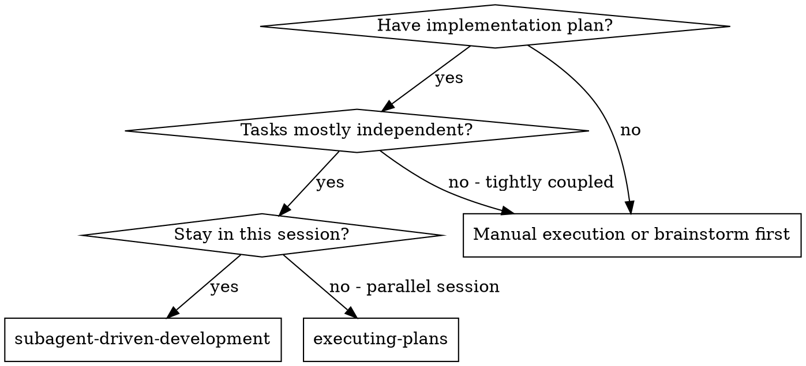
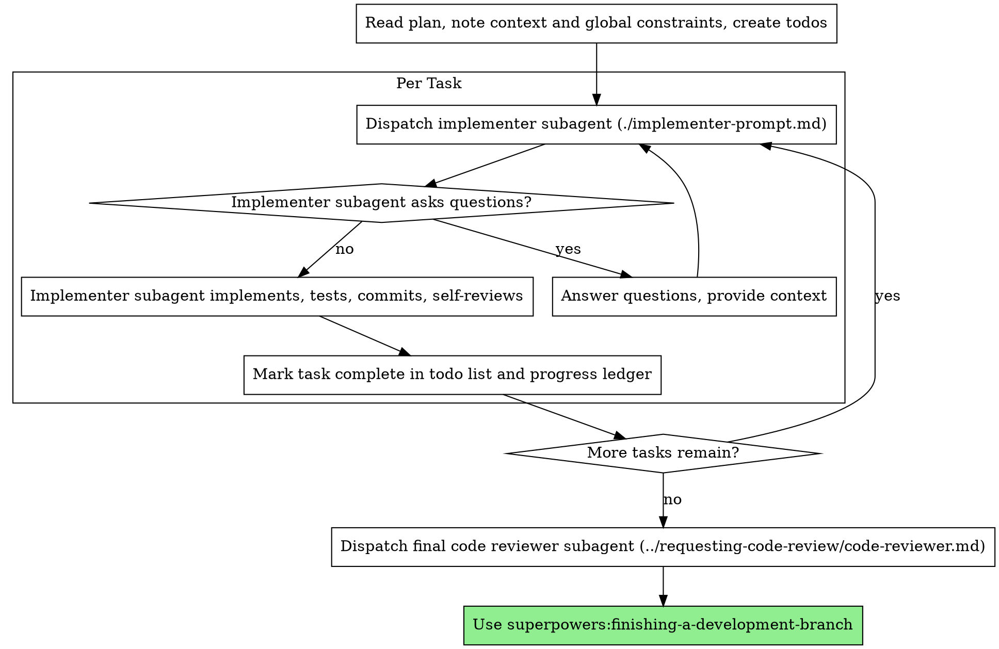

# Subagent-Driven Development

Execute plan by dispatching a fresh implementer subagent per task, then a broad whole-branch review at the end.

**Why subagents:** You delegate tasks to specialized agents with isolated context. By precisely crafting their instructions and context, you ensure they stay focused and succeed at their task. They should never inherit your session's context or history — you construct exactly what they need. This also preserves your own context for coordination work.

**Core principle:** Fresh subagent per task + broad final review = high quality, fast iteration

**Narration:** between tool calls, narrate at most one short line — the
ledger and the tool results carry the record.

**Continuous execution:** Do not pause to check in with your human partner between tasks. Execute all tasks from the plan without stopping. The only reasons to stop are: BLOCKED status you cannot resolve, ambiguity that genuinely prevents progress, or all tasks complete. "Should I continue?" prompts and progress summaries waste their time — they asked you to execute the plan, so execute it.

## When to Use



**vs. Executing Plans (parallel session):**
- Same session (no context switch)
- Fresh subagent per task (no context pollution)
- Broad review at the end
- Faster iteration (no human-in-loop between tasks)

## The Process



## Pre-Flight Plan Review

Before dispatching Task 1, read the plan's `Spec:` pointer (if not `N/A`) and
scan the plan once for conflicts, against the spec's actual text rather than
a guess at what it meant:

- tasks that contradict each other or the plan's Global Constraints
- anything the plan explicitly mandates that is a known defect pattern (a
  test that asserts nothing, verbatim duplication of a logic block)

Record the scan in the ledger either way —
`Pre-flight: clean` or `Pre-flight: N conflicts found` — so a resumed
session can see the scan happened instead of re-running it.

**Non-catastrophic conflicts and ambiguities do not stall the run.** Decide
and record a ruling, then continue: `Pre-flight: <finding> — ruling: <what
governs and why>`. Only stop for your human partner when the conflict is
destructive or irreversible (deleting data, an auth/security boundary
change, a decision that cannot be undone by a later task) — a session left
blocked on a decision the controller could safely make is a wasted turn, not
a caution. The final whole-branch review remains the net for conflicts that
only emerge from implementation.

## Oracle-Independent Tasks (Critical tier)

A task whose brief carries `**Oracle:** independent` (set by `writing-plans`'
Oracle-Independence Gate) is dispatched as two implementer calls, not one:

1. Run `scripts/task-brief PLAN_FILE N`, then strip the brief to REQ
   statement + Acceptance Criteria + Test Cases only before handing it to
   the oracle dispatch — the oracle must not see any other task's
   interfaces, any existing code in the touched files, or your own analysis
   of how to implement it. Dispatch it with `test-driven-development`'s RED
   step only: write the failing test(s), verify the failure reason, commit,
   report DONE. This is a fresh subagent — never the same agent instance
   that implements GREEN.
2. Record the oracle's commit. Dispatch the implementer as normal (full
   task brief, per File Handoffs), plus the oracle's test file path and the
   instruction from the Oracle-Independence Gate: make it pass; flag,
   don't edit, a suspected wrong assertion.
3. Before marking the task complete, confirm GREEN didn't modify the
   oracle's assertions.

Everything else about the task — ledger, completion — is
unchanged; only RED authorship is split into a separate, blinder dispatch.

## Batching Small Same-Shape Tasks

When consecutive tasks are the same shape (e.g. "add field X to model A", "add
field Y to model B", each touching one file with a complete, literal spec),
dispatch them as one implementer call carrying all the briefs, not one
dispatch per task. Batch only when: each task is independently a cheap-model
task per Model Selection below, none depends on another's output, and the
plan's per-task Interfaces blocks don't collide. The final whole-branch
review still verifies every file named across all the batched briefs shows
up in the diff — a batch that silently drops one task's file is not
complete. Tightly
coupled or judgment-heavy tasks are never batched.

## Model Selection

Use the least powerful model that can handle each role to conserve cost and increase speed.

**Mechanical implementation tasks** (isolated functions, clear specs, 1-2 files): use a fast, cheap model. Most implementation tasks are mechanical when the plan is well-specified.

**Integration and judgment tasks** (multi-file coordination, pattern matching, debugging): use a standard model.

**Architecture and design tasks**: use the most capable available model.
The final whole-branch review is one of these — dispatch it on the most
capable available model, not the session default.

**Always specify the model explicitly when dispatching a subagent.** An
omitted model inherits your session's model — often the most capable and
most expensive — which silently defeats this section.

**Turn count beats token price.** Wall-clock and context cost scale with how
many turns a subagent takes, and the cheapest models routinely take 2-3× the
turns on multi-step work — costing more overall. Use a mid-tier model as the
floor for implementers working from prose descriptions.
When the task's plan text contains the complete code to write, the
implementation is transcription plus testing: use the cheapest tier for
that implementer. Single-file mechanical fixes also take the cheapest tier.

**Task complexity signals (implementation tasks):**
- Touches 1-2 files with a complete spec → cheap model
- Touches multiple files with integration concerns → standard model
- Requires design judgment or broad codebase understanding → most capable model

## Cheaper Orchestration (opt-in, Claude Code)

The controller session is the most expensive seat in an SDD run: it reads
every dispatch result and every report, usually on the session's most capable
model. Claude Code allows nested subagents (three layers deep by default;
`CLAUDE_CODE_MAX_SUBAGENT_SPAWN_DEPTH` adjusts it), so the whole loop can run
one layer down for roughly half the cost and wall-clock.

Do this only when your human partner asks for it, or has said the session
model is too expensive to spend on coordination:

- Dispatch **one** orchestrator subagent on a mid-tier model with the plan
  path and the instruction to run this skill end to end.
- The orchestrator dispatches its own implementers and reviewers per Model
  Selection above. The workspace and ledger live on disk, so nothing is lost
  to the extra layer.
- Its final message must carry the **Completion Report** and every pre-flight
  ruling **verbatim** — that relay is how the decisions reach your human
  partner. Relay it, do not summarize it.

Nest a whole plan, never a single task's dispatch — one task buys nothing and
adds a seat.

## Handling Implementer Status

Record BASE (`git rev-parse HEAD`) before dispatching the implementer — the
final whole-branch review needs the full commit range.

Implementer subagents report one of four statuses. Handle each appropriately:

**DONE:** Mark the task complete in the todo list and progress ledger, then move to the next task.

**DONE_WITH_CONCERNS:** The implementer completed the work but flagged doubts. Read the concerns before proceeding. If the concerns are about correctness or scope, address them before moving on. If they're observations (e.g., "this file is getting large"), note them in the ledger and proceed.

**NEEDS_CONTEXT:** The implementer needs information that wasn't provided. Provide the missing context and re-dispatch.

**BLOCKED:** The implementer cannot complete the task. Assess the blocker:
1. If it's a context problem, provide more context and re-dispatch with the same model
2. If the task requires more reasoning, re-dispatch with a more capable model
3. If the task is too large, break it into smaller pieces
4. If the plan itself is wrong, escalate to the human

**Never** ignore an escalation or force the same model to retry without changes. If the implementer said it's stuck, something needs to change.

## Final Review

The final whole-branch review gets a package too: run
`scripts/review-package PLAN_FILE MERGE_BASE HEAD` (MERGE_BASE = the commit the
branch started from, e.g. `git merge-base main HEAD`) and include the
printed path in the final review dispatch, so the final reviewer reads
one file instead of re-deriving the branch diff with git commands.

If the final whole-branch review returns findings, dispatch ONE fix
subagent with the complete findings list — not one fixer per finding.
Per-finding fixers each rebuild context and re-run suites; a real
session's final-review fix wave cost more than all its tasks combined.
Then run exactly one scoped re-review of the fix wave
(`scripts/review-package PLAN_FILE FIX_BASE HEAD` over the fix range,
[re-review-prompt.md](re-review-prompt.md)). Load-bearing residual findings
surface to your human partner when finishing-a-development-branch presents
the options. There is no second fix wave.

## File Handoffs

Everything you paste into a dispatch prompt — and everything a subagent
prints back — stays resident in your context for the rest of the session
and is re-read on every later turn. Hand artifacts over as files:

- **Task brief:** before dispatching an implementer, run this skill's
  `scripts/task-brief PLAN_FILE N` — it extracts the task's full text to a
  uniquely named file and prints the path. Compose the dispatch so the
  brief stays the single source of requirements. Your dispatch should
  contain: (1) one line on where this task fits in the project; (2) the
  brief path, introduced as "read this first — it is your requirements,
  with the exact values to use verbatim"; (3) interfaces and decisions
  from earlier tasks that the brief cannot know; (4) your resolution of
  any ambiguity you noticed in the brief; (5) the report-file path and
  report contract. Exact values (numbers, magic strings, signatures, test
  cases) appear only in the brief.
- **Report file:** name the implementer's report file after the brief
  (brief `…/task-N-brief.md` → report `…/task-N-report.md`) and put it in
  the dispatch prompt. The implementer writes the full report there and
  returns only status, commits, a one-line test summary, and concerns.
- Final-review fix dispatches append their fix report (with test results)
  to the report file and return a short summary; the scoped re-review reads
  the updated file.

## Durable Progress

Conversation memory does not survive compaction. In real sessions,
controllers that lost their place have re-dispatched entire completed task
sequences — the single most expensive failure observed. Track progress in
a ledger file, not only in todos.

- Each plan owns a workspace: at skill start, run this skill's
  `scripts/sdd-workspace PLAN_FILE` — it prints the plan's git-ignored
  directory (`<repo-root>/.ai/<feature-slug>/sdd/`), home to every
  artifact for THIS plan: ledger, briefs, reports, review packages.
  Another plan's directory is never yours to read or write.
- Check for this plan's ledger at `<workspace>/progress.md`. If its first
  line names your plan file, tasks with a `Task <N>: complete` line are DONE
  — do not re-dispatch them; resume at the first task without one. A ledger
  whose first line names a different plan file — or a stray ledger at the
  old flat path `.ai/sdd/progress.md` (pre-task-folder convention) — is another plan's progress: leave it
  in place and start your own, fresh.
- Create the ledger with its identity as the first line:
  `# SDD ledger — plan: <plan file path>`.
- When a task finishes, append one line to the ledger in the same message
  as your other bookkeeping: `Task N: complete (commits <base7>..<head7>)`.
- The ledger is your recovery map: the commits it names exist in git even
  when your context no longer remembers creating them. After compaction,
  trust the ledger and `git log` over your own recollection.
- `git clean -fdx` will destroy the workspace (it's git-ignored scratch); if
  that happens, recover from `git log`.

## Prompt Templates

- [implementer-prompt.md](implementer-prompt.md) - Dispatch implementer subagent
- [re-review-prompt.md](re-review-prompt.md) - Dispatch a scoped re-review of the final-review fix wave
- Final whole-branch review: use superpowers:requesting-code-review's [code-reviewer.md](../requesting-code-review/code-reviewer.md)

## Common Rationalizations

| Excuse | Reality |
|--------|---------|
| "I'll fix it myself, dispatching is overhead" | Controller fixes pollute your context. Dispatch a fix subagent. |
| "Ledger bookkeeping is overhead" | The ledger is what survives compaction. Controllers without one have re-dispatched entire completed task sequences. |
| "Skip the final review, tasks looked fine individually" | Per-task issues compound across a branch — the final whole-branch review is the only gate left; skipping it ships unverified. |

## Example Workflow

```
You: I'm using Subagent-Driven Development to execute this plan.

[Read plan file once: .ai/YYYY-MM-DD-feature-plan/plans/plans-feature-plan.md]
[Create todos for all tasks]

Task 1: Hook installation script

[Run task-brief for Task 1; dispatch implementer with brief + report paths + context]

Implementer: "Before I begin - should the hook be installed at user or system level?"

You: "User level (~/.config/hooks/)"

Implementer: "Got it. Implementing now..."
[Later] Implementer:
  - Implemented install-hook command
  - Added tests, 5/5 passing
  - Self-review: Found I missed --force flag, added it
  - Committed

[Mark Task 1 complete in ledger]

Task 2: Recovery modes

[Run task-brief for Task 2; dispatch implementer with brief + report paths + context]

Implementer: [No questions, proceeds]
Implementer:
  - Added verify/repair modes
  - 8/8 tests passing
  - Self-review: All good
  - Committed

[Mark Task 2 complete in ledger]

...

[After all tasks]
[Dispatch final code-reviewer]
Final reviewer: All requirements met, ready to merge

Done!
```

## Red Flags

**Never:**
- Start implementation on main/master branch without explicit user consent
- Proceed with unfixed issues
- Dispatch multiple implementation subagents in parallel (conflicts)
- Make a subagent read the whole plan file (hand it its task brief —
  `scripts/task-brief` — instead)
- Skip scene-setting context (subagent needs to understand where task fits)
- Ignore subagent questions (answer before letting them proceed)
- Fix findings yourself in the controller session — dispatch a fix subagent instead
- Re-dispatch a task the progress ledger already marks complete — check
  the ledger (and `git log`) after any compaction or resume
- Skip documentation on public constructs — `code-documentation` required before committing
- Skip karpathy lens before committing — catches speculative code, over-engineering, and weak success criteria
- Skip `integration-testing` after a task that creates a component with external dependencies — a unit test with a mock DB does not verify the contract with the real database
- Skip `property-based-testing` for a function with a checkable invariant (round-trip, idempotence, algebraic law) — hand-picked examples under-sample the input space no matter how many are added one at a time
- Skip `deterministic-simulation-testing` after a task implementing a concurrent/distributed component — a passing example-based concurrency test proves one interleaving worked, not that the rare multi-fault interleaving that actually breaks it was ever tried
- Skip `observability-standards` after a task that creates an API endpoint or service component — a deployed endpoint without metrics and a runbook is a production liability
- Skip the final whole-branch review — it is the only review gate this
  skill has left; skipping it ships unverified work
- Let an implementer subagent spawn its own subagents — the
  isolated-context guarantee this skill depends on breaks the moment a
  dispatched agent dispatches its own. Every dispatch in this skill comes
  from the controller only.

**If subagent asks questions:**
- Answer clearly and completely
- Provide additional context if needed
- Don't rush them into implementation

**If subagent fails task:**
- Dispatch fix subagent with specific instructions
- Don't try to fix manually (context pollution)

## Integration

**Required workflow skills:**
- **superpowers:using-git-worktrees** - Ensures isolated workspace (creates one or verifies existing)
- **superpowers:writing-plans** - Creates the plan this skill executes
- **superpowers:requesting-code-review** - Code review template for the final whole-branch review
- **superpowers:finishing-a-development-branch** - Complete development after all tasks

**Subagents should use:**
- **superpowers:test-driven-development** - Subagents follow TDD for each task
- **superpowers:karpathy** - Anti-pattern lens applied before committing: no speculative code, surgical changes, verifiable success criteria
- **superpowers:code-documentation** - Document every public construct written before committing (spec_id, req_id, full docstring)
- **integration-testing** - After any task creating a component with external dependencies: Testcontainers-based integration tests with real DB/queue/cache, transaction rollback isolation, factory pattern
- **property-based-testing** - During TDD's white-box step, for any function with a checkable invariant (round-trip, idempotence, algebraic law): generate inputs instead of hand-picking examples
- **deterministic-simulation-testing** - After any task implementing a concurrent/distributed component (consensus, replication, multi-node coordination): seeded, replayable fault injection instead of (or alongside) example-based concurrency tests
- **observability-standards** - After any task that creates an API endpoint or service component: instrument structured logging, golden signal metrics, SLOs, alert rules, and runbooks

**Alternative workflow:**
- **superpowers:executing-plans** - Use for parallel session instead of same-session execution
---

## Completion Report

When this skill's work is done, report to the user in chat — do not let a commit
message be the only trace of what happened:

- **Produced:** what was created or changed (artifact type + exact path).
- **Verdict:** the reviewer's PASS / NEEDS WORK / BLOCKED result, if a gate ran.
- **Coverage:** which spec REQ / NFR this satisfies, where applicable.
- **Next:** the next step in the flow, or "ready for review / merge".

One line per item is enough. The point is that the user sees what shipped and
its verdict without having to read the diff.
